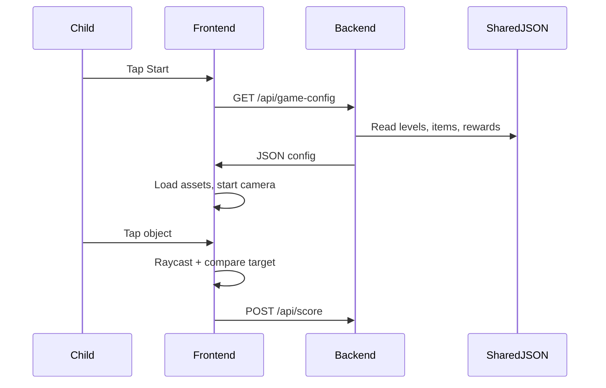

# Architecture

## Overview

The AR Kids Treasure Hunt game is split into three independent areas:

```text
ar-kids-game/
├── frontend/   # Browser rendering, camera, game logic (client)
├── backend/    # REST API, configuration serving
├── shared/     # JSON game data consumed by backend
└── docs/       # Documentation
```

Frontend and backend each have their own `package.json` and run as separate processes.

## Frontend Architecture

```text
main.js
  ├── CameraManager      → Device camera feed (getUserMedia)
  ├── SceneRenderer      → Three.js scene, raycasting, render loop
  ├── AssetLoader        → GLB loading with procedural fallback
  ├── SpawnManager       → Floating object placement & animation
  ├── TargetManager      → Current hunt target selection
  ├── ScoreManager       → Star collection tracking
  ├── LevelManager       → Difficulty progression
  ├── GameManager        → Core gameplay loop orchestration
  ├── AudioManager       → Tone.js synthesized sounds
  ├── VoiceManager       → SpeechSynthesis + locale JSON
  ├── ParticleManager    → Success burst effects
  └── UI (Hud, Menu)     → Visual overlay, no reading required
```

### AR Mode: Camera Overlay

The MVP uses **camera overlay** mode (not WebXR):

- Video element fills the screen as background
- Three.js canvas renders with alpha transparency on top
- 3D objects are parented to the camera anchor group
- Objects float in virtual space relative to the camera

This design intentionally avoids plane detection and world anchoring so the game works in moving vehicles, classrooms, and outdoor environments.

### Future AR Providers

The architecture reserves extension points for:

| Provider | Status | Integration Point |
|----------|--------|-------------------|
| WebXR | Prepared | `gameConfig.ar.futureProviders`, SceneRenderer |
| ARCore | Prepared | Backend config, future native wrapper |
| ARKit | Prepared | Backend config, future native wrapper |

No WebXR/ARCore/ARKit code is implemented in the MVP.

## Backend Architecture

```text
server.js
  ├── middleware/cors.js
  ├── middleware/errorHandler.js
  ├── routes/gameRoutes.js
  │     └── controllers/gameController.js
  │           └── services/configService.js → shared/game-config/
  └── models/ (in-memory score storage)
```

## Data Flow



## Module Size Policy

All source files are kept under 300 lines. Each manager handles a single responsibility.

## Performance Strategy

- GLB model caching in AssetLoader
- Cloned meshes from cache (no re-load per spawn)
- Mobile pixel ratio capped at 2
- Particle count limited to 40
- Delta time clamped to prevent physics spikes
